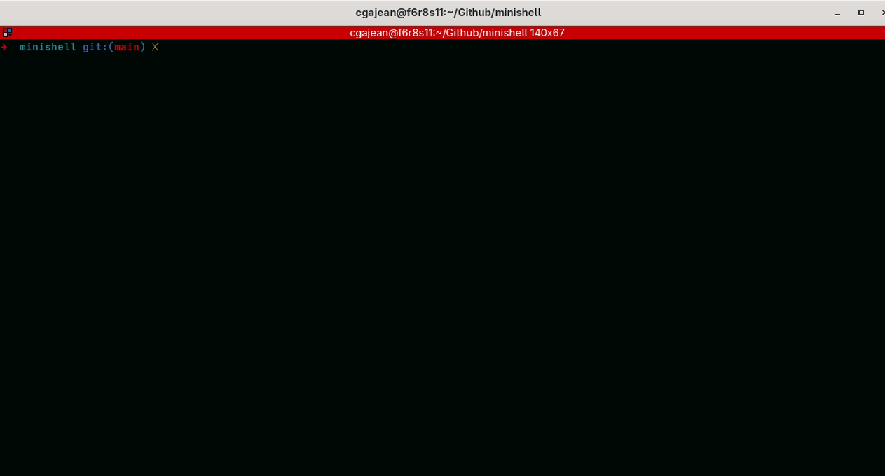

# minishell

> A UNIX shell written from scratch in C — pipes, redirections, heredocs, logical operators, wildcard and variable expansion. Behaviour matched against bash, one edge case at a time.



---

## Description

**minishell** is a functional UNIX shell built as part of the 42 curriculum. It reimplements the core mechanics of bash: lexing, parsing, expansion, execution, and signal handling — without relying on any external parsing library.

The goal was not to clone bash feature-for-feature, but to understand precisely what a shell does at each step between the user hitting Enter and a process returning an exit code.

---

## Features

- Custom lexer and parser
- Pipes `|`
- Input, output, and append redirections — `<`, `>`, `>>`
- Heredoc `<<`
- Logical operators `&&` and `||`
- Wildcard expansion `*`
- Variable expansion `$VAR`, `$?`
- Quote handling — single and double quotes
- Signal handling — `Ctrl-C`, `Ctrl-D`, `Ctrl-\`
- Readline integration with command history
- Builtins: `echo`, `cd`, `pwd`, `export`, `unset`, `env`, `exit`

---

## Build & Run

```bash
make
./minishell
```

---

## Showcase

### Pipes

```bash
ls | grep ".c" | wc -l
```


### Redirections

```bash
echo "hello" > /tmp/out.txt && cat /tmp/out.txt
cat < Makefile | head -5
echo "appended" >> /tmp/out.txt
```

### Heredoc

```bash
cat << EOF
line one
line two
EOF
```

```bash
# Piped heredoc
cat << EOF | grep line
line one
line two
EOF
```


### Logical Operators

```bash
mkdir /tmp/test && echo "created" || echo "failed"
false || echo "fallback works"
true && false || echo "chain works"
```


### Wildcard Expansion

```bash
ls *.c
echo srcs/**/*.c
```

### Variable Expansion

```bash
echo $HOME $USER $PWD
export FOO=bar && echo "foo is $FOO"
echo "exit status: $?"
```


### Builtins

```bash
cd /tmp && pwd && cd -
export TEST=42 && env | grep TEST && unset TEST && env | grep TEST
echo -n "no newline"
exit 42
```

### Edge Cases

```bash
echo '' ""
echo "unclosed      spaces"
echo "$USER is in $PWD and exit was $?"
cat << EOF | grep line
line one
line two
EOF
```

---

## Architecture

Execution follows a strict pipeline:

```
Input
  │
  ▼
Lexer         — tokenizes raw input into typed tokens (WORD, PIPE, REDIR, etc.)
  │
  ▼
Parser        — builds an AST from the token stream
  │
  ▼
Expander      — resolves variables, wildcards, and quote rules
  │
  ▼
Executor      — walks the AST, forks processes, sets up pipes and redirections
  │
  ▼
Builtin / execve
```

**Signals** are managed at each stage independently — interactive prompt, heredoc input, and child process execution each have their own signal disposition.

---

## Project Structure

```
srcs/
├── lexer/        # tokenization, quote state machine
├── parser/       # AST construction
├── expander/     # variable and wildcard expansion
├── executor/     # process forking, pipes, redirections, builtins
├── builtins/     # echo, cd, pwd, export, unset, env, exit
├── signals/      # signal handlers per execution context
└── main.c
includes/
└── minishell.h
```

---

## References

- [bash manual](https://www.gnu.org/software/bash/manual/bash.html)
- [POSIX shell grammar](https://pubs.opengroup.org/onlinepubs/9699919799/utilities/V3_chap02.html)
- `man 2 fork`, `execve`, `pipe`, `dup2`, `waitpid`, `sigaction`
- readline documentation

---

*Built at 42 Paris by Christophe Gajean and Ilies Hadj.*
